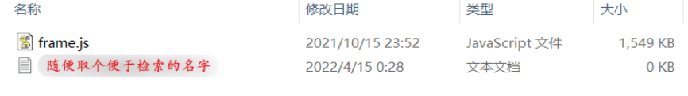
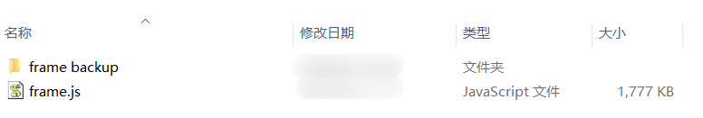

### (1) TyopraTheme-GithubBaseCZC
这是基于Typora自带的Github主题修改得到的个人制定化主题！
　　

# 

### (2) 主要修改步骤

找到 typora 安装路径：`C:\Users\...\Typora\themes`

然后复制`czc-github-base`，放入文件夹中，

再找`C:\Program Files\Typora\resources\appsrc\window`目录，进入这个目录，

为了方便恢复，我们新建一个`frame backup`文件夹用于备份，

复制当前`frame.js`文件放入备份，为了方便软件配合`everthing`搜索，

进入`frame backup`文件夹，新建空文本，取名 `Typora Frame Marker.txt` ，



返回`C:\Program Files\Typora\resources\appsrc\window` 目录，



使用当前`frame.js`文件替换给定的`frame.js`文件

　　
　　
# 


### (3) 代码修改细节
**实时渲染部分的代码**

```javascript
case o.blockquote:
if (f(this).indexOf("【警告】") != -1){
    return "<blockquote " + p(this) + " class='blockquote-jinggao' >"
        + f(this) + "</blockquote>";
} else if (f(this).indexOf("【说明】") != -1) {
    return "<blockquote " + p(this) + " class='blockquote-tuijian' >"
        + f(this) + "</blockquote>";
} else if (f(this).indexOf("【注意】") != -1) {
    return "<blockquote " + p(this) + " class='blockquote-weixian' >"
        + f(this) + "</blockquote>";
} else {
    return "<blockquote " + p(this) + " >" +
        f(this) + "</blockquote>";
}
```

**导出文件部分的代码**

```javascript
case a.blockquote:
if (T(e, n).indexOf("【警告】") != -1) {
    return "<blockquote class='blockquote-jinggao'>"
        + T(e, n) + "</blockquote>";
} else if (T(e, n).indexOf("【说明】") != -1) {
    return "<blockquote class='blockquote-tuijian'>"
        + T(e, n) + "</blockquote>";
} else if (T(e, n).indexOf("【注意】") != -1) {
    return "<blockquote class='blockquote-weixian'>"
        + T(e, n) + "</blockquote>";
} else {
    return "<blockquote class='test'>"
        + T(e, n) + "</blockquote>";
}
```

**前置图标部分的代码**

```javascript
case o.paragraph:
if (f(this).indexOf("【警告】") != -1) {
    return "<p " + p(this)
        + " class='md-end-block md-p'>"
        + "<span data-emoji=\"⚡\" class=\"md-emoji-span\"></span>"
        + f(this) + "</p>";
} else if (f(this).indexOf("【说明】") != -1) {
    return "<p "
        + p(this) + " class='md-end-block md-p'>"
        + "<span data-emoji=\"🔎\" class=\"md-emoji-span\"></span>"
        + f(this) + "</p>";
} else if (f(this).indexOf("【注意】") != -1) {
    return "<p "
        + p(this) + " class='md-end-block md-p'>"
        + "<span data-emoji=\"👻\" class=\"md-emoji-span\"></span>"
        + f(this) + "</p>";
} else {
    return "<p "
        + p(this) + " class='md-end-block md-p'>"
        + f(this) + "</p>";
}
```
